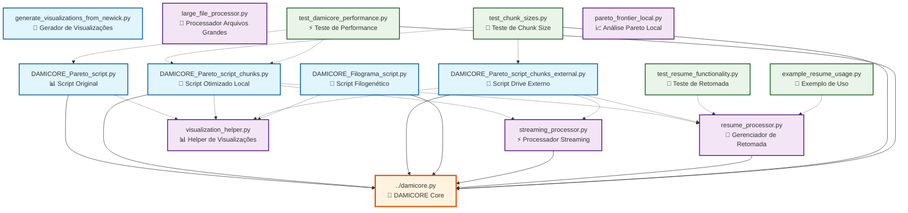

# 🔗 Estrutura de Dependências - Scripts DAMICORE

## 📊 Diagrama de Dependências



## 📋 Categorização dos Scripts

### 🎯 **Scripts Principais (Entry Points)**

| Script | Descrição | Uso Principal |
|--------|-----------|---------------|
| `DAMICORE_Pareto_script.py` | Script original do pipeline | Datasets pequenos/médios |
| `DAMICORE_Pareto_script_chunks.py` | Versão otimizada para chunks locais | Datasets grandes (local) |
| `DAMICORE_Pareto_script_chunks_external.py` | Versão para drive externo | Datasets ultra-grandes |
| `DAMICORE_Filograma_script.py` | Pipeline filogenético completo | Análise filogenética |
| `generate_visualizations_from_newick.py` | Gerador de visualizações standalone | Apenas visualizações |

### 🔧 **Módulos de Apoio**

| Módulo | Função | Usado Por |
|--------|--------|-----------|
| `streaming_processor.py` | Processamento streaming de chunks | Scripts chunks |
| `resume_processor.py` | Sistema de checkpoint/retomada | Scripts otimizados |
| `visualization_helper.py` | Funções de visualização | Todos os scripts principais |
| `large_file_processor.py` | Processamento de arquivos grandes | Scripts chunks |

### 🧪 **Scripts de Teste**

| Script | Propósito | Testa |
|--------|-----------|-------|
| `test_chunk_sizes.py` | Otimização de chunk size | Performance de chunks |
| `test_damicore_performance.py` | Benchmarks de performance | Todos os scripts |
| `test_resume_functionality.py` | Funcionalidade de retomada | Sistema de checkpoint |
| `example_resume_usage.py` | Exemplo de uso de retomada | Resume processor |

### 🛠️ **Utilitários**

| Script | Função |
|--------|--------|
| `pareto_frontier_local.py` | Análise de fronteira de Pareto local |

## 🔄 Fluxo de Dependências

### **1. Pipeline Básico**
```
CSV Input → DAMICORE_Pareto_script.py → damicore.py → Visualizações
```

### **2. Pipeline Otimizado (Local)**
```
CSV Input → DAMICORE_Pareto_script_chunks.py → streaming_processor.py → damicore.py → visualization_helper.py → Visualizações
```

### **3. Pipeline Ultra-Otimizado (Externo)**
```
CSV Input → DAMICORE_Pareto_script_chunks_external.py → resume_processor.py → streaming_processor.py → damicore.py → visualization_helper.py → Visualizações
```

### **4. Pipeline Filogenético**
```
CSV Input → DAMICORE_Filograma_script.py → damicore.py → Visualizações Filogenéticas
```

### **5. Visualizações Standalone**
```
Arquivos Newick → generate_visualizations_from_newick.py → Visualizações
```

## 📊 Matriz de Dependências

| Script | damicore.py | streaming_processor | resume_processor | visualization_helper |
|--------|-------------|-------------------|------------------|---------------------|
| DAMICORE_Pareto_script.py | ✅ | ❌ | ❌ | ✅ |
| DAMICORE_Pareto_script_chunks.py | ✅ | ✅ | ✅ | ✅ |
| DAMICORE_Pareto_script_chunks_external.py | ✅ | ✅ | ✅ | ✅ |
| DAMICORE_Filograma_script.py | ✅ | ❌ | ❌ | ❌ |
| generate_visualizations_from_newick.py | ❌ | ❌ | ❌ | ❌ |

## 🎯 Recomendações de Uso

### **Para Datasets Pequenos (< 1GB)**
- Use: `DAMICORE_Pareto_script.py`
- Dependências: Apenas `damicore.py`

### **Para Datasets Médios (1-10GB)**
- Use: `DAMICORE_Pareto_script_chunks.py`
- Dependências: `damicore.py` + módulos de apoio

### **Para Datasets Grandes (> 10GB)**
- Use: `DAMICORE_Pareto_script_chunks_external.py`
- Dependências: Todos os módulos de apoio

### **Para Análise Filogenética**
- Use: `DAMICORE_Filograma_script.py`
- Dependências: `damicore.py` + bibliotecas de visualização

### **Para Apenas Visualizações**
- Use: `generate_visualizations_from_newick.py`
- Dependências: Apenas bibliotecas de visualização

## 🔧 Configuração de Ambiente

### **Dependências Python Comuns**
```python
pandas, numpy, matplotlib, subprocess, json, os, sys
```

### **Dependências Específicas de Visualização**
```python
toytree, toyplot, Bio.Phylo, matplotlib
```

### **Dependências de Sistema**
```bash
python3, gzip (para DAMICORE)
```

---

**Nota**: As linhas pontilhadas (-.->)  no diagrama indicam dependências opcionais ou condicionais, enquanto as linhas sólidas (-->) indicam dependências obrigatórias.
