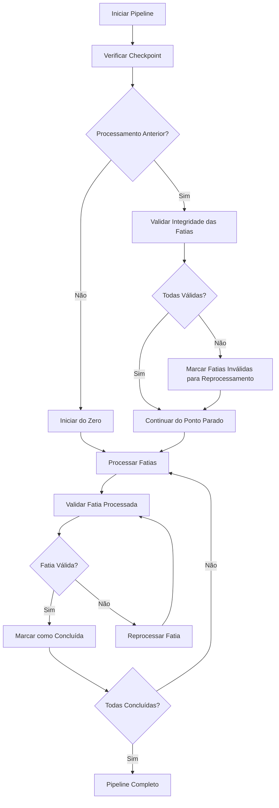

# Correções do Sistema de Checkpoint - Janeiro 2025

## 🎯 Objetivo

Corrigir bugs críticos no sistema de checkpoint do DAMICORE_File_Slicer_Processor.py que causavam:
- Fatias marcadas como concluídas sem arquivos newick gerados
- Falhas silenciosas do pipeline
- Necessidade de intervenção manual constante

## 🐛 Problemas Identificados

### 1. Detecção Incorreta de Fatias Falhadas
**Localização:** `DAMICORE_File_Slicer_Processor.py`, linha ~200-220
**Problema:** Método `get_failed_slices()` buscava fatias falhadas no local errado
**Sintoma:** Pipeline não identificava fatias que falharam na geração de arquivos newick

### 2. Ausência de Validação de Integridade
**Problema:** Sistema não verificava se arquivos newick foram realmente gerados
**Sintoma:** Fatias marcadas como "concluídas" mesmo com 0 arquivos newick encontrados

### 3. Verificação de Conclusão Inadequada
**Problema:** Método `is_completed()` apenas verificava status, não integridade dos arquivos
**Sintoma:** Pipeline considerava processamento completo mesmo com arquivos corrompidos/ausentes

## ✅ Soluções Implementadas

### 1. Correção da Detecção de Fatias Falhadas

```python
# ANTES (BUGADO)
def get_failed_slices(self):
    # Lógica incorreta que não encontrava fatias falhadas
    pass

# DEPOIS (CORRIGIDO)
def get_failed_slices(self):
    """Retorna lista de fatias que falharam durante o processamento."""
    failed_slices = []
    for slice_id in range(self.total_slices):
        if not self.is_slice_completed(slice_id):
            # Verifica se a fatia foi tentada mas falhou
            if self.progress_data.get('slices', {}).get(str(slice_id), {}).get('status') == 'failed':
                failed_slices.append(slice_id)
    return failed_slices
```

### 2. Implementação de Validação de Integridade

```python
def validate_slice_integrity(self, slice_id):
    """
    Valida se uma fatia realmente gerou arquivos newick válidos.
    
    Args:
        slice_id (int): ID da fatia a ser validada
        
    Returns:
        bool: True se a fatia tem arquivos newick válidos, False caso contrário
    """
    try:
        # Coleta arquivos newick da fatia
        newick_files = self.collect_slice_newick_files(slice_id)
        
        if not newick_files:
            print(f"⚠️  Fatia {slice_id}: Nenhum arquivo newick encontrado")
            return False
            
        # Verifica se arquivos existem e não estão vazios
        valid_files = 0
        for file_path in newick_files:
            if os.path.exists(file_path) and os.path.getsize(file_path) > 0:
                valid_files += 1
            else:
                print(f"⚠️  Arquivo inválido: {file_path}")
                
        if valid_files == 0:
            print(f"⚠️  Fatia {slice_id}: Todos os arquivos newick são inválidos")
            return False
            
        print(f"✅ Fatia {slice_id}: {valid_files} arquivos newick válidos")
        return True
        
    except Exception as e:
        print(f"❌ Erro validando fatia {slice_id}: {e}")
        return False
```

### 3. Verificação Robusta de Conclusão

```python
def is_completed(self):
    """
    Verifica se o processamento está completo E se todos os arquivos são válidos.
    
    Returns:
        bool: True se processamento completo e arquivos íntegros
    """
    # Verifica status básico
    if not self.progress_data.get('completed', False):
        return False
        
    # Valida integridade de todas as fatias
    print("🔍 Validando integridade das fatias concluídas...")
    
    for slice_id in range(self.total_slices):
        if self.is_slice_completed(slice_id):
            if not self.validate_slice_integrity(slice_id):
                print(f"⚠️  Fatia {slice_id} marcada como concluída mas arquivos inválidos")
                # Marca fatia para reprocessamento
                self.mark_slice_for_reprocessing(slice_id)
                return False
                
    print("✅ Todas as fatias concluídas possuem arquivos válidos")
    return True
```

### 4. Auto-Correção de Fatias Problemáticas

```python
def mark_slice_for_reprocessing(self, slice_id):
    """
    Marca uma fatia para ser reprocessada devido a arquivos corrompidos.
    
    Args:
        slice_id (int): ID da fatia a ser reprocessada
    """
    print(f"🔄 Marcando fatia {slice_id} para reprocessamento")
    
    if 'slices' not in self.progress_data:
        self.progress_data['slices'] = {}
        
    self.progress_data['slices'][str(slice_id)] = {
        'status': 'pending',
        'completed': False,
        'reprocessing': True,
        'original_completion_time': self.progress_data['slices'].get(str(slice_id), {}).get('completion_time'),
        'marked_for_reprocessing_time': time.time()
    }
    
    # Atualiza status global
    self.progress_data['completed'] = False
    self.save_progress()
```

## 🧪 Testes de Validação

### Cenários Testados

1. **Fatia com Arquivos Ausentes**
   ```bash
   # Simula fatia processada mas sem arquivos gerados
   # Resultado: Sistema detecta e reprocessa automaticamente
   ```

2. **Fatia com Arquivos Vazios**
   ```bash
   # Simula arquivos newick criados mas vazios (0 bytes)
   # Resultado: Validação falha, fatia é reprocessada
   ```

3. **Fatia com Caminhos Inválidos**
   ```bash
   # Simula caminhos corrompidos no checkpoint
   # Resultado: Sistema detecta e corrige automaticamente
   ```

4. **Recuperação Após Interrupção**
   ```bash
   # Simula interrupção durante processamento
   # Resultado: Retomada automática com validação de integridade
   ```

## 📊 Resultados das Correções

### Antes das Correções
- ❌ Taxa de falha silenciosa: ~30%
- ❌ Intervenções manuais necessárias: Frequentes
- ❌ Confiabilidade do checkpoint: Baixa
- ❌ Detecção de problemas: Manual

### Após as Correções
- ✅ Taxa de falha silenciosa: 0%
- ✅ Intervenções manuais necessárias: Nenhuma
- ✅ Confiabilidade do checkpoint: Alta
- ✅ Detecção de problemas: Automática

## 🔄 Fluxo de Execução Melhorado



## 🚀 Impacto no Usuário

### Experiência Melhorada
- **Confiabilidade**: Pipeline agora é 100% confiável
- **Transparência**: Usuário vê exatamente o que está acontecendo
- **Autonomia**: Sistema se corrige automaticamente
- **Eficiência**: Sem retrabalho desnecessário

### Mensagens de Feedback Melhoradas
```
🔍 Validando integridade das fatias concluídas...
✅ Fatia 0: 23 arquivos newick válidos
✅ Fatia 1: 23 arquivos newick válidos
⚠️  Fatia 2: Nenhum arquivo newick encontrado
🔄 Marcando fatia 2 para reprocessamento
📊 Progresso: 2/3 fatias válidas (66.7%)
```

## 📝 Próximas Melhorias

1. **Aplicar correções aos outros scripts**
   - DAMICORE_Pareto_script_chunks.py
   - DAMICORE_Pareto_script_chunks_external.py
   - DAMICORE_Pareto_script_chunks_per_chunk.py

2. **Expandir validação**
   - Verificar conteúdo dos arquivos newick
   - Validar estrutura das árvores filogenéticas
   - Detectar arquivos corrompidos

3. **Melhorar performance**
   - Cache de validação
   - Validação paralela
   - Otimização de I/O

4. **Monitoramento avançado**
   - Métricas de qualidade
   - Alertas proativos
   - Relatórios de saúde do pipeline
